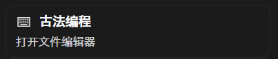
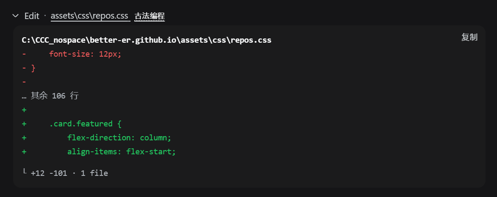
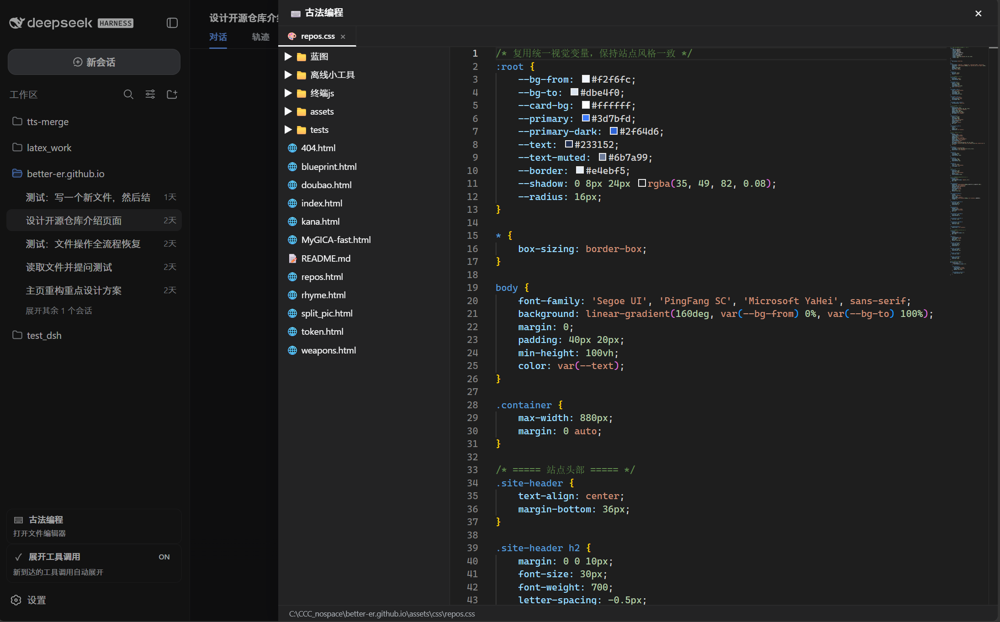

# dsh·古法编程插件

## 引言

为了在 AI 编程的高度发展的今天，保护古法编程这一非物质文化遗产，dsh·古法编程插件被开发出来，让你可以在 DeepSeek Harness 中继续体验大脑的思考能力。

在 DSH 对话界面右侧滑出一个 Monaco 编辑器 + 文件树面板，直接在对话里改本地工作区代码，不用切到外部编辑器。

## 功能

- **面板开关**：侧栏底部「⌨️ 古法编程」按钮，点击展开或收起编辑器面板。
- **文件树**：左侧 250px，懒加载目录、支持折叠或展开，过滤 `.git`、`node_modules` 等。
- **编辑器**：Monaco 编辑器经 CDN 动态加载，多文件 Tab、语法高亮、`Ctrl+S` 保存。
- **状态栏**：底部显示当前文件路径和保存结果。
- **关闭方式**：点击遮罩、按 `Esc` 或点 × 关闭面板，随 DSH 明暗主题自动适配。
- **窄栏适配**：侧栏收起成窄 rail 时自动切换为单图标按钮，展开时恢复完整两行结构。
- **消息流尾巴**：工具行路径、产物区文件按钮后追加「古法编程」尾巴，点击尾巴在插件内打开文件，点击按钮本身保持原有外部打开行为。

## 截图

### 侧边栏开关



侧栏底部的「⌨️ 古法编程」按钮，点击展开或收起编辑器面板。

### 消息流文件按钮的古法编程后缀



消息流中工具行路径与产物区文件按钮后追加的「古法编程」尾巴：点击尾巴在插件内打开，点击按钮本身保持外部打开。

### 编辑器面板



右侧滑入的完整编辑面板：左侧文件树、顶部多文件 Tab、中部 Monaco 编辑器、底部状态栏。

## 演示视频

| 古法编程插件演示（42 秒） |
| :---: |
| [](https://www.bilibili.com/video/BV1d28i6rEEz/) |

## 安装

```powershell
dsh plugin --profile web add github:better-er/dsh-classic-coding
```

一条命令装完即生效，自动挂载，重启 DSH web 后启用，无需手工编辑任何组合文件。

## 卸载

```powershell
dsh plugin --profile web remove dsh-classic-coding
```

彻底移除，重启 DSH web 后不再加载。

## 要求与开发

- **标准形态**：dsh 客户端插件，声明 `dsh.client`、导出 `./client`。
- **自挂载 bundle**：同时声明 `dsh.bundle`，用 `dsh plugin --profile web add` 从 GitHub 安装后自动识别为 profile layer 并挂载，无需手工写组合 entry。
- **独立 RPC 通道**：Host 端经 `ctx.connection.rpc.handle('/classic-coding', ...)` 注册 `describe` / `listDir` / `readFile` / `writeFile` 四个端点，提供文件树与编辑器读写，底层走 DSH 内置 `ctx.fs` 文件系统服务。`/api` 共享通道的唯一拦截器槽位已被官方 gateway 占用，插件端点必须走 handle 独立通道。
- **无构建**：`lib/index.js` 与 `lib/client.js` 均为源码即产物，`package.json` 声明 `dsh.client.platform: "web"`、`exports["./client"] → ./lib/client.js`，改完即用。
- **UI 挂载点**：`sidebar.footer.action` 触发按钮、`shell.overlay` 编辑器面板两个插槽注入。
- **样式**：DSH 主题 CSS 变量 `--dsw-alias-*`，明暗主题自适应，`data-ds-dark-theme` 属性变化时实时跟随切换 Monaco 主题。
- **编辑器加载**：Monaco Editor 经 CDN 动态加载，React 组件从 loader 的 module table 获取，不引入任何额外 npm 依赖。
- **硬性约束**：`lib/client.js` 的 `factory` 必须以 `return module.exports` 结尾，否则模块导出为 `undefined`，DSH 启动即 fail-loud。

## License

[MIT](./LICENSE)